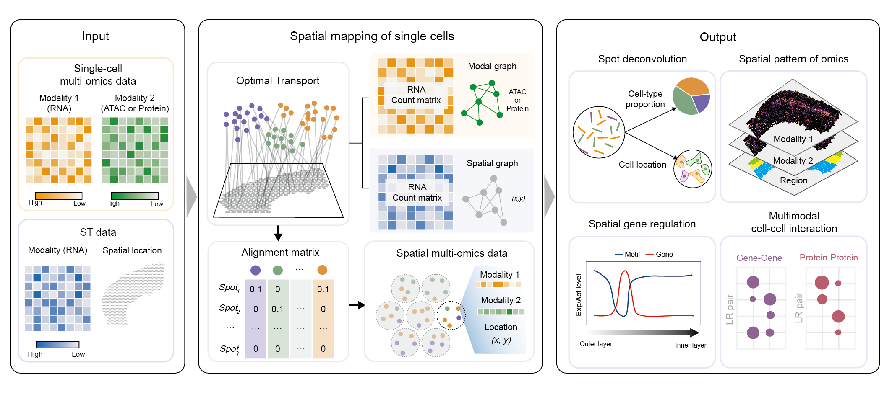

# SpaTrio v1.0.0 </a>

# Revealing spatial multimodal heterogeneity in tissues with SpaTrio

### Penghui Yang<sup></sup>,  Lijun Jin<sup></sup>, Jie Liao<sup></sup>, ..., Xiaohui Fan*


SpaTrio is a computational tool based on optimal transport that can align single-cell multi-omics data in space while preserving spatial topology of the tissue section and local geometry of modality



## Requirements and Installation
This toolkit is written in both R and Python programming languages. The core optimal transport algorithm is implemented in Python, while the initial data preparation and downstream multimodal analysis are written in R.
### Installation of SpaTrio (Python package)

[](https://pypi.org/project/POT/0.8.2/) [](https://github.com/numpy/numpy/) [](https://github.com/pandas-dev/pandas/) [](https://github.com/scikit-learn/scikit-learn/) [](https://github.com/scipy/scipy/) [](https://pypi.org/project/scanpy/) [](https://github.com/scverse/anndata/) [](https://github.com/igraph/igraph/) [](https://pypi.org/project/louvain/0.7.1/) [](https://pypi.org/project/matplotlib/3.5.2/) 


```
# We recommend using Anaconda, and then you can create a new environment.
# Create and activate Python environment
conda create -n spatrio python=3.8
conda activate spatrio

# Install requirements
cd SpaTrio-main
pip install -r requirements.txt

# Install spatrio
python setup.py build
python setup.py install
```
### Installation of SpaTrio (R package)

[](https://www.r-project.org/)

```
install.packages("doParallel")

# Install SpaTrio package from local file
install.packages("SpaTrio_1.0.0.tar.gz", repos = NULL, type = "source")
```

## Quick Start
To use SpaTrio we require formatted `.csv` files as input (i.e. read in by pandas). 
 - multi_rna.csv/spatial_rna.csv (The gene expression matrix of cells/spots)

|  | Cell1 | ··· | Celln |
|--|--|--|--|
| Gene1 | 0 | ··· | 1 |
| ··· | ··· | ··· | ··· |
| Genem | 2 | ··· | 1 |

 - multi_meta.csv/spatial_meta.csv (The meta information matrix of cells/spots)
 
|  | id | type |
|--|--|--|
| Cell1 | Cell1 | A |
| ··· | ··· | ··· |
| Celln | Celln | B |

 - emb.csv (The low-dimensional embedding matrix of cells)

|  | emb1 | ··· | embk |
|--|--|--|--|
| Cell1 | 1.997 | ··· | -0.307 |
| ··· | ··· | ··· | ··· |
| Celln | 2.307 | ··· | 2.119 |

 - pos.csv (The spatial location matrix of spots)

|  | x | y |
|--|--|--|
| Cell1 | 0.28 | 10.65 |
| ··· | ··· | ··· |
| Celln | 5.98 | 2.16 |

At the same time, we also support additional specification of the number of cells in each spot.
 - expected_num.csv (The number of cells contained in each spot)

|  | cell_num |
|--|--|
| Spot1 | 5 | 
| ··· | ··· | 
| Spotj | 2 | 

In some examples of simulated data, the number of cell types in the spot is given (ref_counts.csv). These data will be converted to expected_num for use.
 - ref_counts.csv (The number of celltypes contained in each spot)

|  | Celltype 1 | ··· | Celltype i |
|--|--|--|--|
| Spot1 | 0 | ··· | 2 |
| ··· | ··· | ··· | ··· |
| Spotj | 1 | ··· | 0 |


We have included two test datasets ([demo1](tutorial/data/demo1) & [demo2](tutorial/data/demo2)) in the [tutorial/data/](tutorial/data/) of this repository as examples to show how to use SpaTrio to align cells to space. 

Simulated data in the strip pattern:
* [Demonstration of SpaTrio on demo1 dataset](tutorial/1.demo1.ipynb)

Simulated data in the ring pattern:
* [Demonstration of SpaTrio on demo2 dataset](tutorial/2.demo2.ipynb)

More importantly, we support directly calling the core functions written in Python from the R language to facilitate downstream analysis.

DBiT-seq mouse embryo datasets ([Google Drive](https://drive.google.com/drive/folders/1OOr-QuS4JaxIaOyuvgkemN9cdHr3J6-u?usp=sharing)):
* [Demonstration of SpaTrio on DBiT-seq mouse embryo datasets](tutorial/3.Mouse_embryo.md)

10x Visium+ADT mouse liver datasets ([Google Drive](https://drive.google.com/drive/folders/1WCYdRciBoS8nG91V-eb9w6fE5CLxmCMA?usp=sharing)):
* [Demonstration of SpaTrio on mouse liver datasets](tutorial/4.Mouse_liver.md)
 
## Tutorials

We have applied spatrio on different tissues of multiple species, here we give step-by-step tutorials for all application scenarios. And preprocessed datasets used can be downloaded from [Google Drive](https://drive.google.com/drive/folders/1fl8gXSBuV1yTH_ZpzH6TjfGgZcrFsrmX?usp=sharing).


* [Using spatrio to reconstruct and analyze single-cell multi-modal data of mouse cerebral cortex](tutorial/5.Mouse_brain_cortex.md)

* [Using spatrio to reconstruct and analyze single-cell multi-modal data of human steatosis liver](tutorial/6.Human_steatosis_liver.md)

* [Using spatrio to reconstruct and analyze single-cell multi-modal data of human breast cancer](tutorial/7.Human_breast_cancer.md)

## About
Should you have any questions, please feel free to contact the author of the manuscript, Mr. Penghui Yang (yangph@zju.edu.cn).

## References


