Using SpaTrio to reconstruct and analyze single-cell multi-omics data of
mouse cerebral cortex
================

# Library required R packages

We first load the R package required for spatial reconstruction, and the
R package required for downstream analysis is loaded before running.

``` r
library(Seurat)
```

    ## Attaching SeuratObject

``` r
library(SpaTrio)
library(ggsci)
library(ggplot2)
library(readr)
library(reshape2)
library(dplyr)
```

    ## 
    ## Attaching package: 'dplyr'

    ## The following objects are masked from 'package:stats':
    ## 
    ##     filter, lag

    ## The following objects are masked from 'package:base':
    ## 
    ##     intersect, setdiff, setequal, union

``` r
library(Signac)
```

# Load datasets

We collected [ISSAAC-seq
data](https://www.ebi.ac.uk/biostudies/arrayexpress/studies/E-MTAB-11264)
and [spatial transcriptome
data](https://satijalab.org/seurat/articles/spatial_vignette) of mouse
brain.

``` r
multi_object <- readRDS("~/spatrio_data/ISSAAC/brain.rds")
spatial_object <- readRDS("~/spatrio_data/ISSAAC/brain_st_cortex.rds")

# Cell-type annotation of ST data
Idents(spatial_object)<-spatial_object$seurat_clusters
spatial_object<-RenameIdents(spatial_object,
    '5'  = 'Astro',
    '2' = 'L2/3 IT',
    '7'  = 'L4',
    '1' = 'L5 IT',
    '4' = 'L6 CT',
    '6' = 'Oligo')
spatial_object$type<-Idents(spatial_object)

# Region division of ST data
Idents(spatial_object)<-spatial_object$seurat_clusters
spatial_object<-RenameIdents(spatial_object,
    '5'  = 'Region1',
    '2' = 'Region2',
    '7'  = 'Region3',
    '1' = 'Region4',
    '4' = 'Region5',
    '6' = 'Region6')
Idents(spatial_object,cell="GCCAACCATTTCCGGA-1")<-"Region6"
Idents(spatial_object)=factor(Idents(spatial_object),levels=paste("Region",1:6,sep = ""))
spatial_object$region6<-Idents(spatial_object)
```

``` r
dim(multi_object)
```

    ## [1] 205717  10361

``` r
dim(spatial_object)
```

    ## [1] 31053  1075

Color settings

``` r
atac_col<-c(
"A0"    =   "#5050FFCC" ,
"A1"    =   "#CE3D32CC" ,
"A2"    =   "#749B58CC" ,
"A3"    =   "#F0E685CC" ,
"A4"    =   "#466983CC" ,
"A5"    =   "#BA6338CC" ,
"A6"    =   "#5DB1DDCC" ,
"A7"    =   "#802268CC" ,
"A8"    =   "#6BD76BCC" ,
"A9"    =   "#D595A7CC" ,
"A10"   =   "#924822CC" ,
"A11"   =   "#837B8DCC" ,
"A12"   =   "#C75127CC" ,
"A13"   =   "#D58F5CCC" ,
"A14"   =   "#7A65A5CC" ,
"A15"   =   "#E4AF69CC" ,
"A16"   =   "#3B1B53CC" ,
"A17"   =   "#CDDEB7CC" ,
"A18"   =   "#612A79CC" ,
"A19"   =   "#AE1F63CC" ,
"A20"   =   "#E7C76FCC" ,
"A21"   =   "#5A655ECC" 
)
rna_col<-c(
"R0 Ex-L2/3 IT" =   "#E6161B"   ,
"R1 Ex-L2/3 IT Act" =   "#EC4E14"   ,
"R2 Ex-L4/5 IT" =   "#F2860D"   ,
"R3 Ex-L5 NP"   =   "#F8BE06"   ,
"R4 Ex-L5 NP Cxcl14"    =   "#F6F677"   ,
"R5 Ex-L5 PT"   =   "#f8e1a0"   ,
"R6 Ex-L6 CT"   =   "#BAD36C"   ,
"R7 Ex-L6 IT Bmp3"  =   "#7CAE69"   ,
"R8 Ex-L6 IT Gfra1" =   "#3E8966"   ,
"R9 Ex-L6b" =   "#006463"   ,
"R10 Ex-PIR Ndst4"  =   "#169D9D"   ,
"R11 Misc"  =   "#0C81A8"   ,
"R12 Drd1/Tac1" =   "#195FA5"   ,
"R13 In-Drd2"   =   "#19316B"   ,
"R14 In-Scn5a"  =   "#9EC7CE"   ,
"R15 In-Pvalb"  =   "#D0A29E"   ,
"R16 In-Sst/Chodl"  =   "#A169A9"   ,
"R17 In-Sst/Crhbp"  =   "#A1A1A1"   ,
"R18 In-Vip/Lamp5"  =   "#BA4F54"   ,
"R19 Astro" =   "#BA4F54"   ,
"R20 OPC"   =   "#4FA767"   ,
"R21 Oligo" =   "#9C7DA5"   ,
"R22 VLMC"  =   "#CA4537"   
)
```

UMAP projection of ISSAAC-seq RNA data colored by the RNA annotation

``` r
Idents(multi_object)<-multi_object$annotation
DimPlot(multi_object,reduction = "umap.rna",cols = rna_col)
```

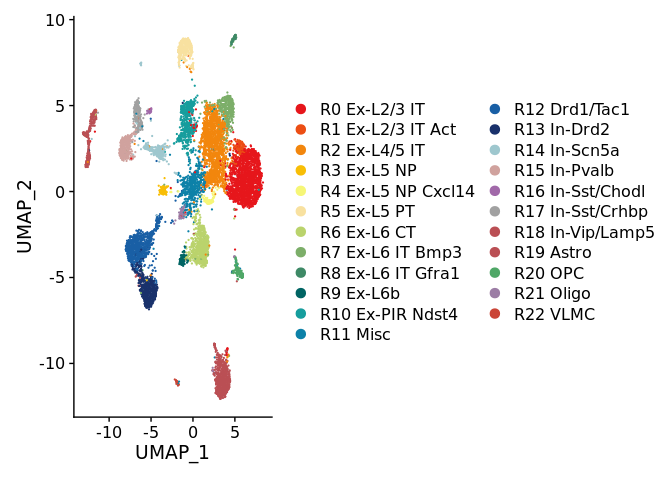<!-- -->

UMAP projection of ISSAAC-seq ATAC data colored by the ATAC clusters

``` r
Idents(multi_object)<-multi_object$ATAC_Cluster
DimPlot(multi_object,reduction = "umap.atac",cols = atac_col)
```

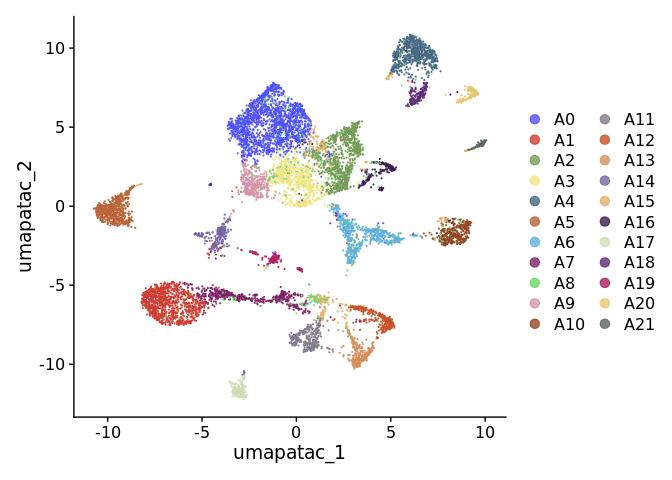<!-- -->

Spatial plot of input ST data

``` r
Idents(spatial_object)<-spatial_object$type
sdplot(spatial_object,pt.size.factor=1.5,image.alpha = 1,stroke = NA,shape=21)
```

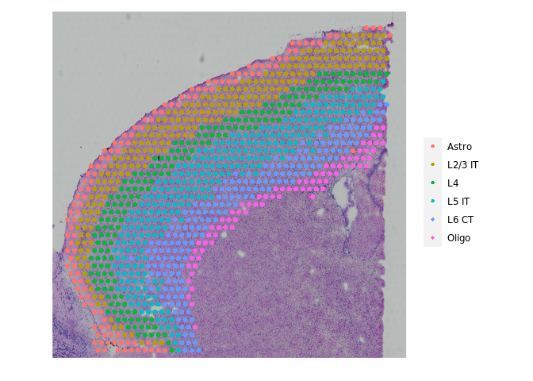<!-- -->

# Run SpaTrio

We enter the following data into SpaTrio, which will build spatial maps of single cells
 - Gene expression count matrix of cells and spots (multi_rna.csv & spatial_rna.csv)
 - Cluster/Cell-type information of cells and spots (multi_meta.csv & spatial_meta.csv)
 - Low-dimensional representation of protein assay (emb.csv)
 - Spatial position coordinates of spots (pos.csv)

``` r
spatrio(spatrio_path='/home/yph/SpaTrio-main',
        py_path="/home/yph/anaconda3/envs/spatrio/bin/python",
        input_path="data/Mouse_brain_cortex",
        output_path="data/Mouse_brain_cortex",
        top_num =10)
```

    ## [1] "Using the Python interpreter with a path of /home/yph/anaconda3/envs/spatrio/bin/python"

# Results of SpaTrio

output.csv contains the mapped probabilities as well spots/cells ids,
annotations and coordinates. This is the staged result of the spatial
reconstruction of SpaTrio.
|Colnames | Meaning | 
|--|--|
|spot|spot id| 
|cell|cell id| 
|value|alignment probabilities|
|spot_type|meta information of spots| 
|cell_type|meta informationof cells| 
|x|coordinates of spots| 
|y|coordinates of spots|
|Cell_xcoord|coordinates of cells| 
|Cell_ycoord|coordinates ofcells|

``` r
output <- read_csv("data/Mouse_brain_cortex/output.csv")
```

    ## New names:
    ## Rows: 10361 Columns: 10
    ## ── Column specification
    ## ──────────────────────────────────────────────────────── Delimiter: "," chr
    ## (2): spot, cell dbl (8): ...1, value, spot_type, cell_type, x, y, Cell_xcoord,
    ## Cell_ycoord
    ## ℹ Use `spec()` to retrieve the full column specification for this data. ℹ
    ## Specify the column types or set `show_col_types = FALSE` to quiet this message.
    ## • `` -> `...1`

``` r
head(output)
```

    ## # A tibble: 6 × 10
    ##    ...1 spot           cell    value spot_…¹ cell_…²     x     y Cell_…³ Cell_…⁴
    ##   <dbl> <chr>          <chr>   <dbl>   <dbl>   <dbl> <dbl> <dbl>   <dbl>   <dbl>
    ## 1  2054 AAACAGAGCGACT… TGTA… 9.65e-5       2       0 1148. 5336.   1148.   5359.
    ## 2  2765 AAACAGAGCGACT… GGAA… 9.65e-5       2       0 1148. 5336.   1213.   5327.
    ## 3  3535 AAACAGAGCGACT… TCAA… 9.65e-5       2       0 1148. 5336.   1123.   5325.
    ## 4  4365 AAACAGAGCGACT… TGTA… 9.65e-5       2       0 1148. 5336.   1163.   5329.
    ## 5  4818 AAACAGAGCGACT… ATCC… 9.65e-5       2       0 1148. 5336.   1188.   5332.
    ## 6  6839 AAACAGAGCGACT… CCCA… 9.65e-5       2       0 1148. 5336.   1135.   5351.
    ## # … with abbreviated variable names ¹​spot_type, ²​cell_type, ³​Cell_xcoord,
    ## #   ⁴​Cell_ycoord

Create single-cell spatial multi-omics data reconstructed by SpaTrio

``` r
pred<-subset(multi_object,cell=output$cell)
coordinate = output[,c("Cell_xcoord","Cell_ycoord")]
coordinate<-as.data.frame(coordinate)
colnames(coordinate)<-c("x","y")
rownames(coordinate)<-output$cell
pred@images[["slice1"]]=NULL
pred@images$image =  new(
Class = 'SlideSeq',
assay = "RNA",
key = "image_",
coordinates = coordinate)
output<-as.data.frame(output)
rownames(output)<-output$cell
pred<-AddMetaData(pred, output[,2:10])

# Add region information
region_meta=data.frame(spot=colnames(spatial_object),region6=spatial_object$region6)
output<-left_join(output,region_meta,by="spot")
output<-as.data.frame(output)
rownames(output)<-output$cell
output<-output[colnames(pred),]
pred$region6<-output$region6
```

Spatial plot of single-cell spatial multi-omics data reconstructed by
SpaTrio

``` r
Idents(pred)<-pred$annotation
sdplot(pred,pt.size.factor = 3)+scale_fill_manual(values = rna_col)+NoLegend()
```

    ## Scale for fill is already present.
    ## Adding another scale for fill, which will replace the existing scale.

<!-- -->

We extracted a subset of cells to better demonstrate the layered
structure of the cortex

``` r
index <- readRDS("data/Mouse_brain_cortex/index.rds")
sub_data<-subset(pred,cell=index)
sdplot(sub_data,pt.size.factor = 4)+scale_fill_manual(values = rna_col)+NoLegend()
```

    ## Scale for fill is already present.
    ## Adding another scale for fill, which will replace the existing scale.

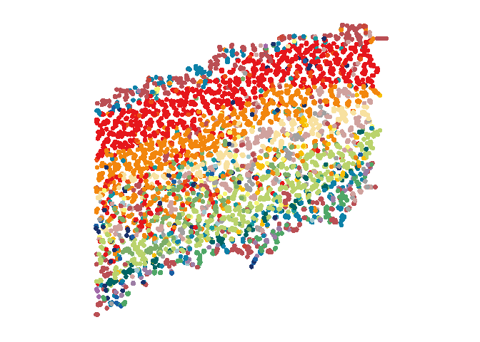<!-- -->

## Boxplot of distance

We selected the main layer-related cell subpopulations and calculated
their Euclidean distances to the innermost cells (R21 Oligo) to quantify
the spatially layered distribution of cell subpopulations

``` r
library(reshape2)
dist_plot<-function(object,coord=c('x', 'y'),root="Cell type 1",level= c("Cell type 1","Cell type 2","Cell type 3")){
  dist_spot <- dist(object@images$image@coordinates[, coord]) %>% as.matrix
  dist_spot<-melt(dist_spot)
  dist_spot<-dist_spot[dist_spot$Var2%in%colnames(subset(object,idents = root)),]
  meta=data.frame(Var1 = colnames(object),type=object@active.ident)
  dist_spot<-left_join(dist_spot,meta,by="Var1")
#dist_spot$type<-gsub("cluster","Cell type ",dist_spot$type)
  dist_spot<-dist_spot[dist_spot$type%in%level,]
dist_spot$type=factor(dist_spot$type,levels = level)
ggplot(dist_spot, aes(x = type, y = value,fill=type))+
geom_boxplot(width=0.5,position=position_dodge(0.9),outlier.shape=NA)+
labs(x="", y = "Distance")+
theme_bw(base_rect_size=1)+
theme(panel.grid =element_blank())+NoLegend()+
FontSize(x.title = 15, y.title = 15,y.text=15,x.text=15)+
theme(legend.text = element_text(size=15),legend.title = element_text(size=15))+
theme(legend.key = element_rect(color = NA, fill = NA),legend.key.size = unit(1, "cm"))+
theme(axis.text.x = element_text(color ="black",angle=45,hjust = 1),axis.text.y  = element_text(color ="black"))+
scale_fill_manual(values = rna_col[level])
}

Idents(sub_data)<-sub_data$annotation
sub<-subset(sub_data,ident=c('R0 Ex-L2/3 IT','R1 Ex-L2/3 IT Act','R2 Ex-L4/5 IT','R5 Ex-L5 PT','R6 Ex-L6 CT','R7 Ex-L6 IT Bmp3','R9 Ex-L6b',"R21 Oligo"))
dist_plot(sub,root = "R21 Oligo",level =c('R0 Ex-L2/3 IT','R1 Ex-L2/3 IT Act','R2 Ex-L4/5 IT','R5 Ex-L5 PT','R6 Ex-L6 CT','R7 Ex-L6 IT Bmp3','R9 Ex-L6b'))
```

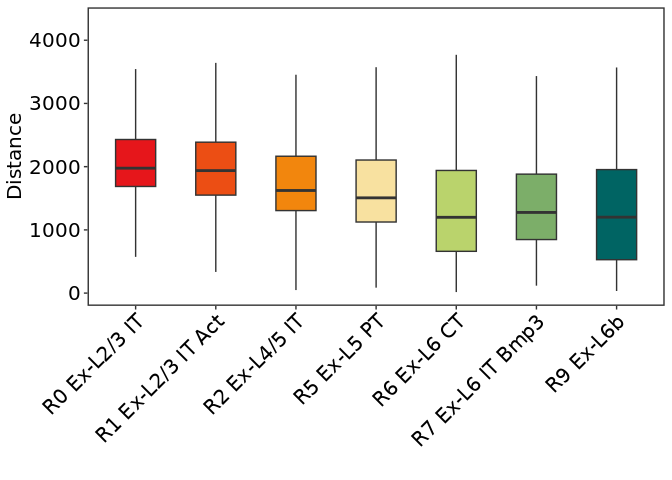<!-- -->

## Proportion of cell subpopulations

``` r
# Bar plot
Idents(sub)<-sub$annotation
cell.prop<-as.data.frame(prop.table(table(Idents(sub), sub$region6),1))
colnames(cell.prop)<-c("cluster","sample","proportion")
cell.prop$cluster=factor(cell.prop$cluster,levels = levels(Idents(sub)))
ggplot(cell.prop,aes(x=sample,y=proportion,fill=cluster))+geom_bar(stat="identity",position="dodge",width = 0.9)+theme_bw(base_rect_size=1)+theme(panel.grid =element_blank())+FontSize(x.title = 15, y.title = 15,y.text=15,x.text=15)+theme(legend.text = element_text(size=15))+theme(legend.key = element_rect(color = NA, fill = NA),legend.key.size = unit(1, "cm"))+labs(x = "Cell type", y = "Proportion")+guides(fill=guide_legend(title=NULL))+ theme(axis.text.x = element_text(color ="black",angle = 45,hjust = 1),axis.text.y  = element_text(color ="black"))+scale_fill_manual(values =rna_col[levels(Idents(sub))])+
  guides(fill=guide_legend(title=NULL))
```

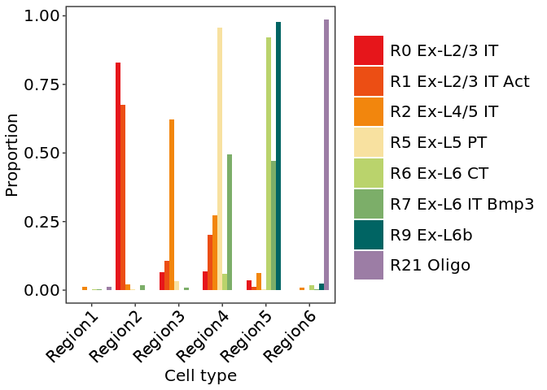<!-- -->

``` r
# Line plot
cell.prop<-as.data.frame(prop.table(table(Idents(sub), sub$region6),1))
colnames(cell.prop)<-c("cluster","sample","proportion")
cell.prop$cluster=factor(cell.prop$cluster,levels = levels(Idents(sub)))
ggplot(data=cell.prop, aes(x=sample, y=proportion,group=cluster,color=cluster)) +geom_line(size=1.5)+theme_bw(base_rect_size=1)+theme(panel.grid =element_blank())+FontSize(x.title = 15, y.title = 15,y.text=15,x.text=15)+theme(legend.text = element_text(size=15))+theme(legend.key = element_rect(color = NA, fill = NA),legend.key.size = unit(1, "cm"))+labs(x = "Cell type", y = "Proportion")+ theme(axis.text.x = element_text(color ="black",angle = 45,hjust = 1),axis.text.y  = element_text(color ="black"))+scale_color_manual(values =rna_col[levels(Idents(sub))])+guides(color=guide_legend(title=NULL))
```

    ## Warning: Using `size` aesthetic for lines was deprecated in ggplot2 3.4.0.
    ## ℹ Please use `linewidth` instead.

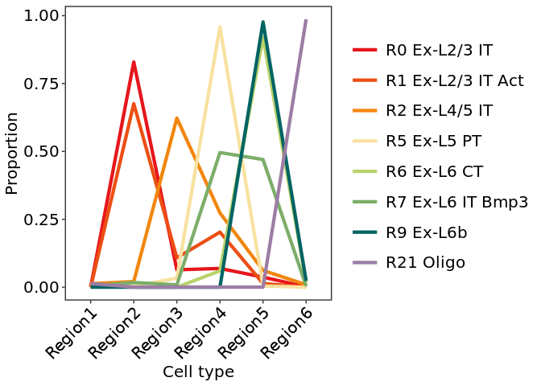<!-- -->

## Highlight of cell subpopulations

Highlight selected cell subpopulations to visualize their spatial
distribution

``` r
Idents(sub)<-sub$annotation
p=list()
for (i in levels(Idents(sub))) {
  p[[i]]<-sdplot(sub,ident = "annotation",highlight.clsuter = i,pt.size.factor = 4,cols.highlight = c("#DE2D26", "grey90"))+labs(title = i)+NoLegend()
}
CombinePlots(p)
```

    ## Warning: CombinePlots is being deprecated. Plots should now be combined using
    ## the patchwork system.

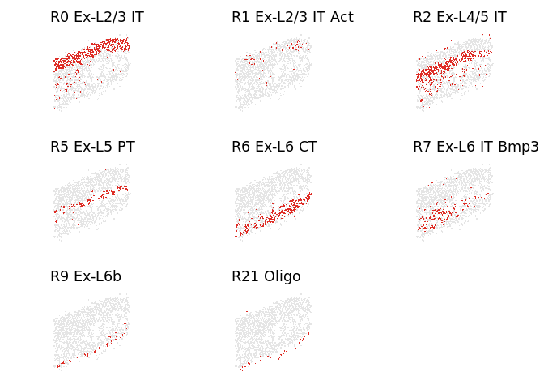<!-- -->

# Spatiotemporal analysis of gene regulation

## Motif activity analysis

We calculate motif activity using chromVAR package from the Greenleaf
lab. Motif activity will be together with gene expression, and will
participate in the analysis of gene spatiotemporal regulation in the
next step

``` r
library(Signac)
library(Seurat)
library(JASPAR2020)
library(TFBSTools)
```

    ## 

``` r
library(motifmatchr)
library(BSgenome.Mmusculus.UCSC.mm10)
```

    ## Loading required package: BSgenome

    ## Loading required package: BiocGenerics

    ## 
    ## Attaching package: 'BiocGenerics'

    ## The following objects are masked from 'package:dplyr':
    ## 
    ##     combine, intersect, setdiff, union

    ## The following objects are masked from 'package:stats':
    ## 
    ##     IQR, mad, sd, var, xtabs

    ## The following objects are masked from 'package:base':
    ## 
    ##     anyDuplicated, aperm, append, as.data.frame, basename, cbind,
    ##     colnames, dirname, do.call, duplicated, eval, evalq, Filter, Find,
    ##     get, grep, grepl, intersect, is.unsorted, lapply, Map, mapply,
    ##     match, mget, order, paste, pmax, pmax.int, pmin, pmin.int,
    ##     Position, rank, rbind, Reduce, rownames, sapply, setdiff, sort,
    ##     table, tapply, union, unique, unsplit, which.max, which.min

    ## Loading required package: S4Vectors

    ## Loading required package: stats4

    ## 
    ## Attaching package: 'S4Vectors'

    ## The following objects are masked from 'package:dplyr':
    ## 
    ##     first, rename

    ## The following objects are masked from 'package:base':
    ## 
    ##     expand.grid, I, unname

    ## Loading required package: IRanges

    ## 
    ## Attaching package: 'IRanges'

    ## The following objects are masked from 'package:dplyr':
    ## 
    ##     collapse, desc, slice

    ## Loading required package: GenomeInfoDb

    ## Loading required package: GenomicRanges

    ## Loading required package: Biostrings

    ## Loading required package: XVector

    ## 
    ## Attaching package: 'Biostrings'

    ## The following object is masked from 'package:base':
    ## 
    ##     strsplit

    ## Loading required package: rtracklayer

``` r
library(chromVAR)
library(ggseqlogo)
library(tidyr)
```

    ## 
    ## Attaching package: 'tidyr'

    ## The following object is masked from 'package:S4Vectors':
    ## 
    ##     expand

    ## The following object is masked from 'package:reshape2':
    ## 
    ##     smiths

``` r
set.seed(1234)

# pfm <- getMatrixSet(
#   x = JASPAR2020,
#   opts = list(collection = "CORE", 
#               tax_group = 'vertebrates', 
#               all_versions = FALSE)
# )
# # add motif information
# DefaultAssay(pred)<-"peaks"
# pred <- AddMotifs(
#   object = pred,
#   genome = BSgenome.Mmusculus.UCSC.mm10,
#   pfm = pfm
# )
# # Building motif matrix
# # Finding motif positions
# # Creating Motif object
# 
# # motifs matrix
# GetAssayData(object = pred, slot = "motifs")
# 
# # motif deviation score
# pred <- RunChromVAR(
#   object = pred,
#   genome = BSgenome.Mmusculus.UCSC.mm10
# )

pred <- readRDS("~/spatrio_data/ISSAAC/spatrio/pred.rds")## In order to save running time, we load the processed data
```

## Motif-gene regulation analysis

We classified transcription factors into three groups based on the
correlation between transcription factor activity and transcription
factor expression: 1. Transcription factors whose motif activity was
significantly positively correlated with gene expression 2.
Transcription factors that showed negative correlation 3. Transcription
factors with insignificant correlation

``` r
library(dplyr)
library(tibble)
library(data.table)
```

    ## 
    ## Attaching package: 'data.table'

    ## The following object is masked from 'package:GenomicRanges':
    ## 
    ##     shift

    ## The following object is masked from 'package:IRanges':
    ## 
    ##     shift

    ## The following objects are masked from 'package:S4Vectors':
    ## 
    ##     first, second

    ## The following objects are masked from 'package:dplyr':
    ## 
    ##     between, first, last

    ## The following objects are masked from 'package:reshape2':
    ## 
    ##     dcast, melt

``` r
library(dplyr)
library(org.Hs.eg.db)
```

    ## Loading required package: AnnotationDbi

    ## Loading required package: Biobase

    ## Welcome to Bioconductor
    ## 
    ##     Vignettes contain introductory material; view with
    ##     'browseVignettes()'. To cite Bioconductor, see
    ##     'citation("Biobase")', and for packages 'citation("pkgname")'.

    ## 
    ## Attaching package: 'AnnotationDbi'

    ## The following object is masked from 'package:dplyr':
    ## 
    ##     select

    ## 

``` r
library(Orthology.eg.db)
```

    ## 

``` r
library(org.Mm.eg.db)
```

    ## 

``` r
library(stringr)
library(tidyr)
fun <- function(gns){
egs <- mapIds(org.Hs.eg.db, gns, "ENTREZID","SYMBOL")
mapped <- select(Orthology.eg.db, egs,"Mus.musculus","Homo.sapiens")
mapped$mouse <- mapIds(org.Mm.eg.db, as.character(mapped$Mus.musculus), "SYMBOL", "ENTREZID")
mapped
}
motifs <- pred@assays[["peaks"]]@motifs@motif.names

# Create a data frame of motifs and corresponding gene names
motif_names <- data.frame(genes=unlist(motifs)) %>%
  rownames_to_column(var="motif") %>%
  arrange(genes)
motif_names <- dplyr::mutate(motif_names, gene = str_split(genes, pattern="::")) %>%
  unnest(gene) %>%
  dplyr::select(motif, gene) %>%
  distinct() %>%
  arrange(gene) %>%
  dplyr::filter(!str_detect(gene, pattern="var.")) %>%
  as.data.frame()
motif_names$gene_name<-motif_names$gene
id<-motif_names$gene

# Tansfer gene id
id2<-fun(id)
```

    ## 'select()' returned 1:1 mapping between keys and columns

    ## 'select()' returned 1:1 mapping between keys and columns

``` r
for (i in which(!is.na(id2$Homo.sapiens))){
  motif_names$gene_name[i]<-id2$mouse[i]
}
motif_names$gene_name<-as.character(motif_names$gene_name)
selected_motif<-motif_names[!motif_names$gene_name=="NULL",]

# Select major cell types
motif_gene_sub<-subset(pred,ident=c('R0 Ex-L2/3 IT','R1 Ex-L2/3 IT Act','R2 Ex-L4/5 IT','R3 Ex-L5 NP','R4 Ex-L5 NP Cxcl14','R5 Ex-L5 PT','R6 Ex-L6 CT','R7 Ex-L6 IT Bmp3','R8 Ex-L6 IT Gfra1','R16' = 'R9 Ex-L6b'))
```

``` r
# Calculate fold changes of motifs activity
DefaultAssay(motif_gene_sub) <- "chromvar"
aver_chromvar_all <- FindAllMarkers(motif_gene_sub, min.pct=0, logfc.threshold=0,mean.fxn=rowMeans)
```

    ## Calculating cluster R0 Ex-L2/3 IT

    ## Calculating cluster R1 Ex-L2/3 IT Act

    ## Calculating cluster R2 Ex-L4/5 IT

    ## Calculating cluster R3 Ex-L5 NP

    ## Calculating cluster R4 Ex-L5 NP Cxcl14

    ## Calculating cluster R5 Ex-L5 PT

    ## Calculating cluster R6 Ex-L6 CT

    ## Calculating cluster R7 Ex-L6 IT Bmp3

    ## Calculating cluster R8 Ex-L6 IT Gfra1

    ## Calculating cluster R9 Ex-L6b

``` r
head(aver_chromvar_all)
```

    ##          p_val avg_log2FC pct.1 pct.2 p_val_adj       cluster     gene
    ## MA1627.1     0   1.670990 0.800 0.256         0 R0 Ex-L2/3 IT MA1627.1
    ## MA0162.4     0   1.397538 0.745 0.272         0 R0 Ex-L2/3 IT MA0162.4
    ## MA1472.1     0  -2.264143 0.149 0.646         0 R0 Ex-L2/3 IT MA1472.1
    ## MA0669.1     0  -2.757321 0.310 0.797         0 R0 Ex-L2/3 IT MA0669.1
    ## MA1618.1     0  -2.803910 0.233 0.730         0 R0 Ex-L2/3 IT MA1618.1
    ## MA0461.2     0  -2.840856 0.339 0.802         0 R0 Ex-L2/3 IT MA0461.2

``` r
# Calculate fold changes of genes expression
#DefaultAssay(motif_gene_sub)<-"RNA"
#aver_exp_all <- FindAllMarkers(motif_gene_sub, assays="RNA",min.pct=0, logfc.threshold=0)
aver_exp_all_layer <- readRDS("data/Mouse_brain_cortex/aver_exp_all_layer.rds")## In order to save running time, we load the calculated data
head(aver_exp_all_layer)
```

    ##                 p_val avg_log2FC pct.1 pct.2     p_val_adj       cluster
    ## Rasgrf2  0.000000e+00  1.4554960 0.807 0.228  0.000000e+00 R0 Ex-L2/3 IT
    ## Nectin3 3.527793e-245  0.8962522 0.578 0.152 1.138948e-240 R0 Ex-L2/3 IT
    ## Calb1   4.394780e-244  0.8862734 0.535 0.124 1.418855e-239 R0 Ex-L2/3 IT
    ## Enpp2   9.082863e-239  1.0684938 0.823 0.420 2.932402e-234 R0 Ex-L2/3 IT
    ## Lamp5   8.833945e-205  0.8617897 0.804 0.400 2.852039e-200 R0 Ex-L2/3 IT
    ## Cux2    8.580294e-191  0.7167030 0.523 0.149 2.770148e-186 R0 Ex-L2/3 IT
    ##            gene
    ## Rasgrf2 Rasgrf2
    ## Nectin3 Nectin3
    ## Calb1     Calb1
    ## Enpp2     Enpp2
    ## Lamp5     Lamp5
    ## Cux2       Cux2

Visualization of significant gene-motif combos for celltypes

``` r
df.sig<-gene_motif_analysis(motif_gene_sub,selected_motif,aver_exp_all=aver_exp_all_layer,aver_chromvar_all=aver_chromvar_all)
```
    ## There were 50 or more warnings (use warnings() to see the first 50)

``` r
gene_motif_plot(df.sig,plot = "sig")+scale_color_manual(values = rna_col[levels(df.sig$celltype)])
```

    ## `geom_smooth()` using formula = 'y ~ x'

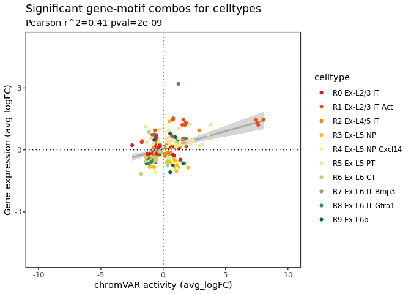<!-- -->

``` r
gene_motif_plot(df.sig,plot = "pos")+scale_color_manual(values = rna_col[levels(df.sig$celltype)])
```

    ## `geom_smooth()` using formula = 'y ~ x'

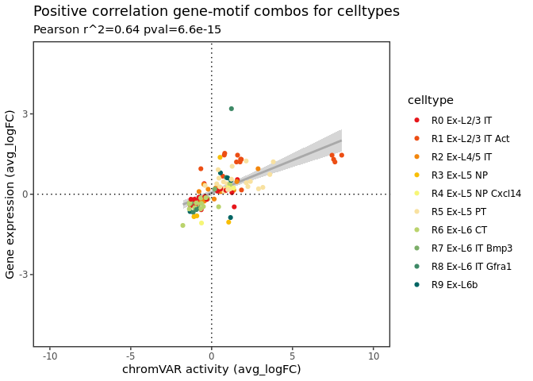<!-- -->

``` r
gene_motif_plot(df.sig,plot = "neg")+scale_color_manual(values = rna_col[levels(df.sig$celltype)])
```

    ## `geom_smooth()` using formula = 'y ~ x'

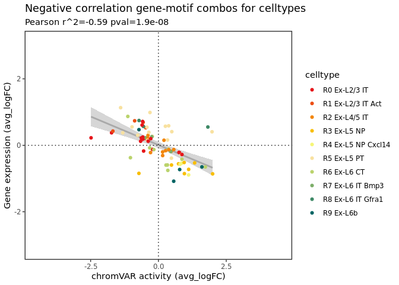<!-- -->

Get results of significant gene-motif combos for celltypes

``` r
gene_motif_list<-gene_motif_plot(df.sig,plot = "sig",return_data = T)
names(gene_motif_list)
```

    ## [1] "sig" "pos" "neg"

Line plot of selected gene-motif combos for celltypes

``` r
gene_motif_lineplot(motif_gene_sub,feature_gene = "Rorb",selected_motif)+scale_color_manual(values = rev(pal_lancet()(2)))
```

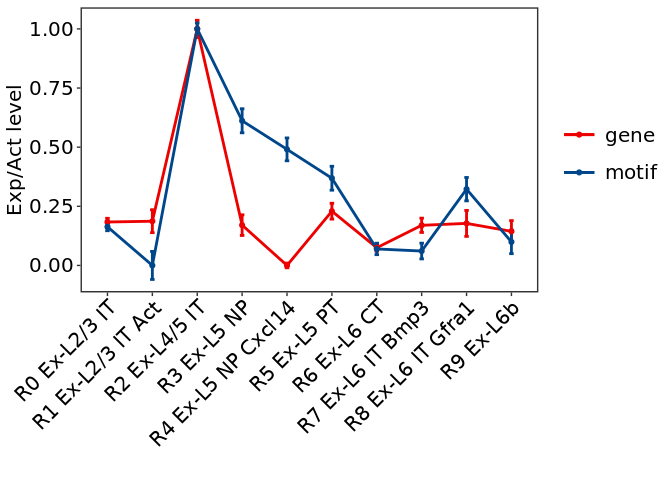<!-- -->

Spatiotemporal pattern of selected motif and its corresponding gene

``` r
sfplot(motif_gene_sub,features = c("MA1150.1","Rorb"),pt.size.factor = 5)
```

    ## Scale for fill is already present.
    ## Adding another scale for fill, which will replace the existing scale.

    ## Warning: Could not find Rorb in the default search locations, found in RNA
    ## assay instead

    ## Scale for fill is already present.
    ## Adding another scale for fill, which will replace the existing scale.

    ## Warning: CombinePlots is being deprecated. Plots should now be combined using
    ## the patchwork system.

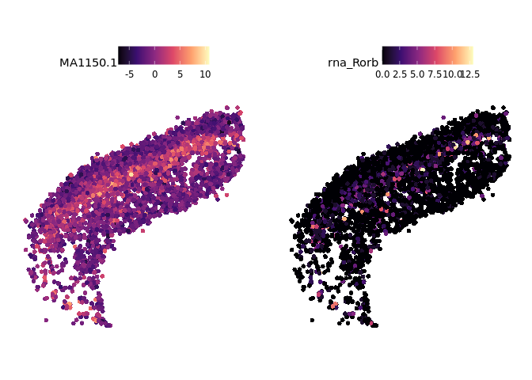<!-- -->

# Analysis of R2 Ex-L4/5 IT

In ISSAAC-seq data, L4/5 IT cells were considered a population based on
transcriptome but were divided into three subpopulations based on the
epigenome, indicating higher heterogeneity in chromatin accessibility of
these cells. This difference between the two modalities is very
important for studying gene regulation. Therefore, we focused on
analyzing the population of cells.

``` r
Idents(pred)<-pred$annotation
l4_5<-subset(pred,ident=("R2 Ex-L4/5 IT"))
Idents(l4_5)<-l4_5$ATAC_Cluster
```

``` r
cell.prop<-as.data.frame(table(l4_5$ATAC_Cluster))
colnames(cell.prop)<-c("cluster","number")
cell.prop<-cell.prop[order(cell.prop$number,decreasing = T),]
cell.prop$cluster=factor(cell.prop$cluster,levels = cell.prop$cluster)
ggplot(cell.prop,aes(x=cluster,y=number,fill=cluster))+geom_bar(stat="identity",position="dodge",width = 0.9)+theme_bw(base_rect_size=1.5)+theme(panel.grid =element_blank())+FontSize(x.title = 15, y.title = 15,y.text=15,x.text=15)+theme(legend.text = element_text(size=15))+theme(legend.key = element_rect(color = NA, fill = NA),legend.key.size = unit(1, "cm"))+labs(x = "Sample", y = "Cell number")+guides(fill=guide_legend(title=NULL))+ theme(axis.text.x = element_text(color ="black",angle = 45,hjust = 1),axis.text.y  = element_text(color ="black"))+scale_fill_manual(values = atac_col[cell.prop$cluster])
```

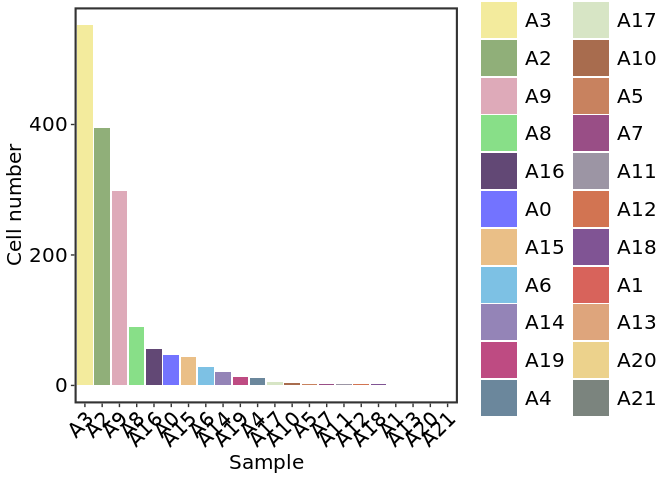<!-- -->

We selected the three main clusters:A2, A3, and A9

``` r
l4_5<-subset(l4_5,ident=c("A2","A3","A9"))
sdplot(l4_5,pt.size.factor = 3)+scale_fill_manual(values = atac_col[c("A2","A3","A9")])+NoLegend()
```

    ## Scale for fill is already present.
    ## Adding another scale for fill, which will replace the existing scale.

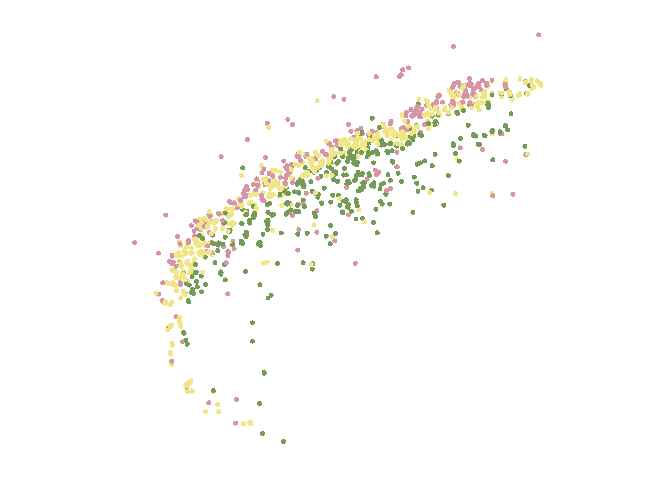<!-- -->

## Spatial gene module analysis of R2 Ex-L4/5 IT 
Based on the results of SpaTrio, we can also analyze the co-expression characteristics of
features. Whether it is transcriptome, epigenome or proteome, they all
form a certain expression pattern in space, and some features will form
a co-expression trend in space. Spatrio can find this kind of
relationship similar to “resonance” through analysis.

``` r
# Calculate the value of sigma
spatial_object$xcoord<-spatial_object@images$anterior1@coordinates$imagerow
spatial_object$ycoord<-spatial_object@images$anterior1@coordinates$imagecol
kNN_dist <- dbscan::kNN(na.omit(spatial_object@meta.data[, c('xcoord', 'ycoord')]), k=6)$dist
spot_dist <- median(kNN_dist) %>% round
spot_dist
```

    ## [1] 138

``` r
l4_5$xcoord<-l4_5@images$image@coordinates$x
l4_5$ycoord<-l4_5@images$image@coordinates$y
DefaultAssay(l4_5)<-"RNA"
l4_5<-NormalizeData(l4_5)%>%FindVariableFeatures(nfeatures =5000)%>%ScaleData()%>%
RunPCA(verbose = FALSE) %>%FindNeighbors(reduction = "pca", dims = 1:30)%>%RunUMAP(dims = 1:30,reduction = "pca")
```

    ## Centering and scaling data matrix

    ## Computing nearest neighbor graph

    ## Computing SNN

    ## Warning: The default method for RunUMAP has changed from calling Python UMAP via reticulate to the R-native UWOT using the cosine metric
    ## To use Python UMAP via reticulate, set umap.method to 'umap-learn' and metric to 'correlation'
    ## This message will be shown once per session

    ## 00:41:05 UMAP embedding parameters a = 0.9922 b = 1.112

    ## 00:41:05 Read 1244 rows and found 30 numeric columns

    ## 00:41:05 Using Annoy for neighbor search, n_neighbors = 30

    ## 00:41:05 Building Annoy index with metric = cosine, n_trees = 50

    ## 0%   10   20   30   40   50   60   70   80   90   100%

    ## [----|----|----|----|----|----|----|----|----|----|

    ## **************************************************|
    ## 00:41:05 Writing NN index file to temp file /tmp/RtmpPLvxwk/file220668b3c081
    ## 00:41:05 Searching Annoy index using 1 thread, search_k = 3000
    ## 00:41:05 Annoy recall = 100%
    ## 00:41:06 Commencing smooth kNN distance calibration using 1 thread with target n_neighbors = 30
    ## 00:41:08 Initializing from normalized Laplacian + noise (using irlba)
    ## 00:41:08 Commencing optimization for 500 epochs, with 52686 positive edges
    ## 00:41:11 Optimization finished

    ## Warning: Cannot add objects with duplicate keys (offending key: UMAP_), setting
    ## key to 'umap_'

``` r
feature_select<-rownames(l4_5)
# Detection of spatial gene modules
module_list<-spatrio_resonance(l4_5,
    sigma=140,
    assay='RNA',
    feature_select=feature_select,
    correlation='pearson',
    maxK=8,
    k=6,
    min_avg_con=0.3,
    min_avg_cor=0.3,
    min_featuer=20,
    max_featuer=1200,
    smooth = "reduction",
    min_pct_cutoff=0.15,
    reduction="umap")
```

    ## Feature filtering...
    ## Filtering features...
    ## Data smoothing
    ## Smoothing with reduction...

    ## Loading required package: foreach
    ## Loading required package: iterators
    ## Loading required package: parallel

    ##   |                                                                              |                                                                      |   0%Running in parallel using  5 cores ..
    ##   |                                                                              |                                                                      |   1%  |                                                                              |=                                                                     |   1%  |                                                                              |=                                                                     |   2%  |                                                                              |==                                                                    |   2%  |                                                                              |==                                                                    |   3%  |                                                                              |==                                                                    |   4%  |                                                                              |===                                                                   |   4%  |                                                                              |===                                                                   |   5%  |                                                                              |====                                                                  |   5%  |                                                                              |====                                                                  |   6%  |                                                                              |=====                                                                 |   6%  |                                                                              |=====                                                                 |   7%  |                                                                              |=====                                                                 |   8%  |                                                                              |======                                                                |   8%  |                                                                              |======                                                                |   9%  |                                                                              |=======                                                               |   9%  |                                                                              |=======                                                               |  10%  |                                                                              |=======                                                               |  11%  |                                                                              |========                                                              |  11%  |                                                                              |========                                                              |  12%  |                                                                              |=========                                                             |  12%  |                                                                              |=========                                                             |  13%  |                                                                              |=========                                                             |  14%  |                                                                              |==========                                                            |  14%  |                                                                              |==========                                                            |  15%  |                                                                              |===========                                                           |  15%  |                                                                              |===========                                                           |  16%  |                                                                              |============                                                          |  16%  |                                                                              |============                                                          |  17%  |                                                                              |============                                                          |  18%  |                                                                              |=============                                                         |  18%  |                                                                              |=============                                                         |  19%  |                                                                              |==============                                                        |  19%  |                                                                              |==============                                                        |  20%  |                                                                              |==============                                                        |  21%  |                                                                              |===============                                                       |  21%  |                                                                              |===============                                                       |  22%  |                                                                              |================                                                      |  22%  |                                                                              |================                                                      |  23%  |                                                                              |================                                                      |  24%  |                                                                              |=================                                                     |  24%  |                                                                              |=================                                                     |  25%  |                                                                              |==================                                                    |  25%  |                                                                              |==================                                                    |  26%  |                                                                              |===================                                                   |  26%  |                                                                              |===================                                                   |  27%  |                                                                              |===================                                                   |  28%  |                                                                              |====================                                                  |  28%  |                                                                              |====================                                                  |  29%  |                                                                              |=====================                                                 |  29%  |                                                                              |=====================                                                 |  30%  |                                                                              |=====================                                                 |  31%  |                                                                              |======================                                                |  31%  |                                                                              |======================                                                |  32%  |                                                                              |=======================                                               |  32%  |                                                                              |=======================                                               |  33%  |                                                                              |=======================                                               |  34%  |                                                                              |========================                                              |  34%  |                                                                              |========================                                              |  35%  |                                                                              |=========================                                             |  35%  |                                                                              |=========================                                             |  36%  |                                                                              |==========================                                            |  36%  |                                                                              |==========================                                            |  37%  |                                                                              |==========================                                            |  38%  |                                                                              |===========================                                           |  38%  |                                                                              |===========================                                           |  39%  |                                                                              |============================                                          |  39%  |                                                                              |============================                                          |  40%  |                                                                              |============================                                          |  41%  |                                                                              |=============================                                         |  41%  |                                                                              |=============================                                         |  42%  |                                                                              |==============================                                        |  42%  |                                                                              |==============================                                        |  43%  |                                                                              |==============================                                        |  44%  |                                                                              |===============================                                       |  44%  |                                                                              |===============================                                       |  45%  |                                                                              |================================                                      |  45%  |                                                                              |================================                                      |  46%  |                                                                              |=================================                                     |  46%  |                                                                              |=================================                                     |  47%  |                                                                              |=================================                                     |  48%  |                                                                              |==================================                                    |  48%  |                                                                              |==================================                                    |  49%  |                                                                              |===================================                                   |  49%  |                                                                              |===================================                                   |  50%  |                                                                              |===================================                                   |  51%  |                                                                              |====================================                                  |  51%  |                                                                              |====================================                                  |  52%  |                                                                              |=====================================                                 |  52%  |                                                                              |=====================================                                 |  53%  |                                                                              |=====================================                                 |  54%  |                                                                              |======================================                                |  54%  |                                                                              |======================================                                |  55%  |                                                                              |=======================================                               |  55%  |                                                                              |=======================================                               |  56%  |                                                                              |========================================                              |  56%  |                                                                              |========================================                              |  57%  |                                                                              |========================================                              |  58%  |                                                                              |=========================================                             |  58%  |                                                                              |=========================================                             |  59%  |                                                                              |==========================================                            |  59%  |                                                                              |==========================================                            |  60%  |                                                                              |==========================================                            |  61%  |                                                                              |===========================================                           |  61%  |                                                                              |===========================================                           |  62%  |                                                                              |============================================                          |  62%  |                                                                              |============================================                          |  63%  |                                                                              |============================================                          |  64%  |                                                                              |=============================================                         |  64%  |                                                                              |=============================================                         |  65%  |                                                                              |==============================================                        |  65%  |                                                                              |==============================================                        |  66%  |                                                                              |===============================================                       |  66%  |                                                                              |===============================================                       |  67%  |                                                                              |===============================================                       |  68%  |                                                                              |================================================                      |  68%  |                                                                              |================================================                      |  69%  |                                                                              |=================================================                     |  69%  |                                                                              |=================================================                     |  70%  |                                                                              |=================================================                     |  71%  |                                                                              |==================================================                    |  71%  |                                                                              |==================================================                    |  72%  |                                                                              |===================================================                   |  72%  |                                                                              |===================================================                   |  73%  |                                                                              |===================================================                   |  74%  |                                                                              |====================================================                  |  74%  |                                                                              |====================================================                  |  75%  |                                                                              |=====================================================                 |  75%  |                                                                              |=====================================================                 |  76%  |                                                                              |======================================================                |  76%  |                                                                              |======================================================                |  77%  |                                                                              |======================================================                |  78%  |                                                                              |=======================================================               |  78%  |                                                                              |=======================================================               |  79%  |                                                                              |========================================================              |  79%  |                                                                              |========================================================              |  80%  |                                                                              |========================================================              |  81%  |                                                                              |=========================================================             |  81%  |                                                                              |=========================================================             |  82%  |                                                                              |==========================================================            |  82%  |                                                                              |==========================================================            |  83%  |                                                                              |==========================================================            |  84%  |                                                                              |===========================================================           |  84%  |                                                                              |===========================================================           |  85%  |                                                                              |============================================================          |  85%  |                                                                              |============================================================          |  86%  |                                                                              |=============================================================         |  86%  |                                                                              |=============================================================         |  87%  |                                                                              |=============================================================         |  88%  |                                                                              |==============================================================        |  88%  |                                                                              |==============================================================        |  89%  |                                                                              |===============================================================       |  89%  |                                                                              |===============================================================       |  90%  |                                                                              |===============================================================       |  91%  |                                                                              |================================================================      |  91%  |                                                                              |================================================================      |  92%  |                                                                              |=================================================================     |  92%  |                                                                              |=================================================================     |  93%  |                                                                              |=================================================================     |  94%  |                                                                              |==================================================================    |  94%  |                                                                              |==================================================================    |  95%  |                                                                              |===================================================================   |  95%  |                                                                              |===================================================================   |  96%  |                                                                              |====================================================================  |  96%  |                                                                              |====================================================================  |  97%  |                                                                              |====================================================================  |  98%  |                                                                              |===================================================================== |  98%  |                                                                              |===================================================================== |  99%  |                                                                              |======================================================================|  99%  |                                                                              |======================================================================| 100%
    ## Merging results ..
    ## 
    ## Time Elapsed:  23.3131864070892 secs 
    ## Calculating with 4609 features...
    ## Data scaling...

    ## Centering and scaling data matrix

    ## Spatially weighted correlation calculating...
    ## Consensus clustering...

    ## end fraction
    ## clustered
    ## clustered
    ## clustered
    ## clustered
    ## clustered
    ## clustered
    ## clustered

    ## Feature module calculating...
    ## [1] 20

Heatmap of identified modules

``` r
spatrio_heatmap(module_list,ann_cols = pal_d3()(length(module_list$group)))
```

    ## $Group
    ##     Module1     Module2 
    ## "#1F77B4FF" "#FF7F0EFF"

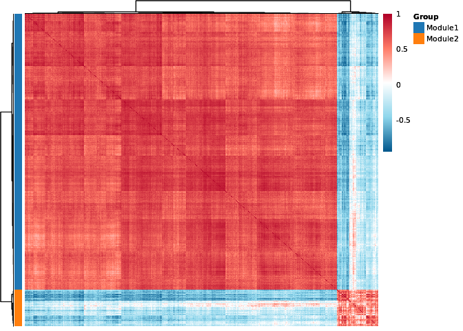<!-- -->

Module activity scores can be calculated for each cell based on the
features contained in the module

``` r
l4_5<-spatrio_score(l4_5,module_list,nbin = 5,ctrl = 20,clean=T)
plot=list()
plot[[1]]<-sfplot(l4_5,features=c("Module1"),pt.size.factor=5,option="D",max.cutoff = 0.3,min.cutoff = 0)
```

    ## Scale for fill is already present.
    ## Adding another scale for fill, which will replace the existing scale.

``` r
plot[[2]]<-sfplot(l4_5,features=c("Module2"),pt.size.factor=5,option="D",max.cutoff = 0.6,min.cutoff = 0.2)
```

    ## Scale for fill is already present.
    ## Adding another scale for fill, which will replace the existing scale.

``` r
CombinePlots(plot)
```

    ## Warning: CombinePlots is being deprecated. Plots should now be combined using
    ## the patchwork system.

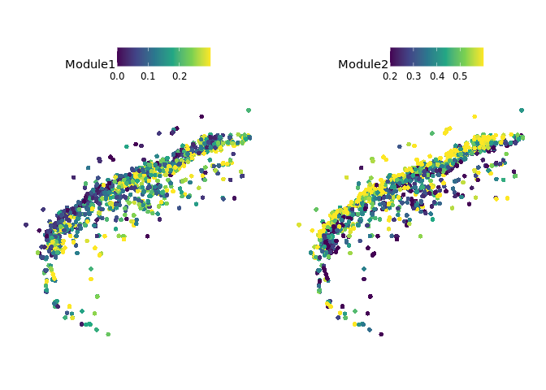<!-- -->

## Spatial motif module analysis of R2 Ex-L4/5 IT

The spatial modules of motif activity contain spatial regulatory
relationships and can also be identified by SpaTrio

``` r
pfm <- getMatrixSet(
  x = JASPAR2020,
  opts = list(collection = "CORE", 
              tax_group = 'vertebrates', 
              all_versions = FALSE)
)
DefaultAssay(l4_5)<-"peaks"
l4_5 <- AddMotifs(
  object = l4_5,
  genome = BSgenome.Mmusculus.UCSC.mm10,
  pfm = pfm
)
```

    ## Building motif matrix

    ## Finding motif positions

    ## Creating Motif object

``` r
GetAssayData(object = l4_5, slot = "motifs")
```

    ## A Motif object containing 746 motifs in 205717 regions

``` r
l4_5 <- RunChromVAR(
  object = l4_5,
  genome = BSgenome.Mmusculus.UCSC.mm10
)
```

    ## Computing GC bias per region

    ## Selecting background regions

    ## Computing deviations from background

    ## Constructing chromVAR assay

``` r
DefaultAssay(l4_5)<-"peaks"
l4_5 <- RunTFIDF(l4_5)
```

    ## Performing TF-IDF normalization

    ## Warning in RunTFIDF.default(object = GetAssayData(object = object, slot =
    ## "counts"), : Some features contain 0 total counts

``` r
l4_5 <- FindTopFeatures(l4_5, min.cutoff = 'q0')
l4_5 <- RunSVD(l4_5)
```

    ## Running SVD

    ## Scaling cell embeddings

``` r
l4_5 <- RunUMAP(l4_5, reduction = 'lsi', dims = 2:30)
```

    ## 00:57:36 UMAP embedding parameters a = 0.9922 b = 1.112

    ## 00:57:36 Read 1244 rows and found 29 numeric columns

    ## 00:57:36 Using Annoy for neighbor search, n_neighbors = 30

    ## 00:57:36 Building Annoy index with metric = cosine, n_trees = 50

    ## 0%   10   20   30   40   50   60   70   80   90   100%

    ## [----|----|----|----|----|----|----|----|----|----|

    ## **************************************************|
    ## 00:57:36 Writing NN index file to temp file /tmp/RtmpPLvxwk/file22064fd64d45
    ## 00:57:36 Searching Annoy index using 1 thread, search_k = 3000
    ## 00:57:36 Annoy recall = 100%
    ## 00:57:38 Commencing smooth kNN distance calibration using 1 thread with target n_neighbors = 30
    ## 00:57:40 Initializing from normalized Laplacian + noise (using irlba)
    ## 00:57:40 Commencing optimization for 500 epochs, with 48644 positive edges
    ## 00:57:42 Optimization finished

    ## Warning: Cannot add objects with duplicate keys (offending key: UMAP_) setting
    ## key to original value 'umap_'

``` r
DefaultAssay(l4_5)<-"chromvar"
feature_select<-rownames(l4_5@assays$chromvar)
rm(module_list)
allfile <- dir("untitled_consensus_cluster")
file.remove(paste("untitled_consensus_cluster",allfile,sep = "/"))
```

    ##  [1] TRUE TRUE TRUE TRUE TRUE TRUE TRUE TRUE TRUE TRUE TRUE

``` r
module_list<-spatrio_resonance(l4_5,
                           sigma=140,
                           assay='chromvar',
                           feature_select=feature_select,
                           correlation='pearson',
                           maxK=8,
                           k=6,
                           min_avg_con=0.3,
                           min_avg_cor=0.3,
                           min_featuer=20,
                           max_featuer=400,
                           smooth = "reduction",
                           reduction="umap",
                           smooth_k= 10)
```

    ## Feature filtering...
    ## Using all features...
    ## Data smoothing
    ## Smoothing with reduction...
    ##   |                                                                              |                                                                      |   0%Running in parallel using  5 cores ..
    ##   |                                                                              |                                                                      |   1%  |                                                                              |=                                                                     |   1%  |                                                                              |=                                                                     |   2%  |                                                                              |==                                                                    |   2%  |                                                                              |==                                                                    |   3%  |                                                                              |==                                                                    |   4%  |                                                                              |===                                                                   |   4%  |                                                                              |===                                                                   |   5%  |                                                                              |====                                                                  |   5%  |                                                                              |====                                                                  |   6%  |                                                                              |=====                                                                 |   6%  |                                                                              |=====                                                                 |   7%  |                                                                              |=====                                                                 |   8%  |                                                                              |======                                                                |   8%  |                                                                              |======                                                                |   9%  |                                                                              |=======                                                               |   9%  |                                                                              |=======                                                               |  10%  |                                                                              |=======                                                               |  11%  |                                                                              |========                                                              |  11%  |                                                                              |========                                                              |  12%  |                                                                              |=========                                                             |  12%  |                                                                              |=========                                                             |  13%  |                                                                              |=========                                                             |  14%  |                                                                              |==========                                                            |  14%  |                                                                              |==========                                                            |  15%  |                                                                              |===========                                                           |  15%  |                                                                              |===========                                                           |  16%  |                                                                              |============                                                          |  16%  |                                                                              |============                                                          |  17%  |                                                                              |============                                                          |  18%  |                                                                              |=============                                                         |  18%  |                                                                              |=============                                                         |  19%  |                                                                              |==============                                                        |  19%  |                                                                              |==============                                                        |  20%  |                                                                              |==============                                                        |  21%  |                                                                              |===============                                                       |  21%  |                                                                              |===============                                                       |  22%  |                                                                              |================                                                      |  22%  |                                                                              |================                                                      |  23%  |                                                                              |================                                                      |  24%  |                                                                              |=================                                                     |  24%  |                                                                              |=================                                                     |  25%  |                                                                              |==================                                                    |  25%  |                                                                              |==================                                                    |  26%  |                                                                              |===================                                                   |  26%  |                                                                              |===================                                                   |  27%  |                                                                              |===================                                                   |  28%  |                                                                              |====================                                                  |  28%  |                                                                              |====================                                                  |  29%  |                                                                              |=====================                                                 |  29%  |                                                                              |=====================                                                 |  30%  |                                                                              |=====================                                                 |  31%  |                                                                              |======================                                                |  31%  |                                                                              |======================                                                |  32%  |                                                                              |=======================                                               |  32%  |                                                                              |=======================                                               |  33%  |                                                                              |=======================                                               |  34%  |                                                                              |========================                                              |  34%  |                                                                              |========================                                              |  35%  |                                                                              |=========================                                             |  35%  |                                                                              |=========================                                             |  36%  |                                                                              |==========================                                            |  36%  |                                                                              |==========================                                            |  37%  |                                                                              |==========================                                            |  38%  |                                                                              |===========================                                           |  38%  |                                                                              |===========================                                           |  39%  |                                                                              |============================                                          |  39%  |                                                                              |============================                                          |  40%  |                                                                              |============================                                          |  41%  |                                                                              |=============================                                         |  41%  |                                                                              |=============================                                         |  42%  |                                                                              |==============================                                        |  42%  |                                                                              |==============================                                        |  43%  |                                                                              |==============================                                        |  44%  |                                                                              |===============================                                       |  44%  |                                                                              |===============================                                       |  45%  |                                                                              |================================                                      |  45%  |                                                                              |================================                                      |  46%  |                                                                              |=================================                                     |  46%  |                                                                              |=================================                                     |  47%  |                                                                              |=================================                                     |  48%  |                                                                              |==================================                                    |  48%  |                                                                              |==================================                                    |  49%  |                                                                              |===================================                                   |  49%  |                                                                              |===================================                                   |  50%  |                                                                              |===================================                                   |  51%  |                                                                              |====================================                                  |  51%  |                                                                              |====================================                                  |  52%  |                                                                              |=====================================                                 |  52%  |                                                                              |=====================================                                 |  53%  |                                                                              |=====================================                                 |  54%  |                                                                              |======================================                                |  54%  |                                                                              |======================================                                |  55%  |                                                                              |=======================================                               |  55%  |                                                                              |=======================================                               |  56%  |                                                                              |========================================                              |  56%  |                                                                              |========================================                              |  57%  |                                                                              |========================================                              |  58%  |                                                                              |=========================================                             |  58%  |                                                                              |=========================================                             |  59%  |                                                                              |==========================================                            |  59%  |                                                                              |==========================================                            |  60%  |                                                                              |==========================================                            |  61%  |                                                                              |===========================================                           |  61%  |                                                                              |===========================================                           |  62%  |                                                                              |============================================                          |  62%  |                                                                              |============================================                          |  63%  |                                                                              |============================================                          |  64%  |                                                                              |=============================================                         |  64%  |                                                                              |=============================================                         |  65%  |                                                                              |==============================================                        |  65%  |                                                                              |==============================================                        |  66%  |                                                                              |===============================================                       |  66%  |                                                                              |===============================================                       |  67%  |                                                                              |===============================================                       |  68%  |                                                                              |================================================                      |  68%  |                                                                              |================================================                      |  69%  |                                                                              |=================================================                     |  69%  |                                                                              |=================================================                     |  70%  |                                                                              |=================================================                     |  71%  |                                                                              |==================================================                    |  71%  |                                                                              |==================================================                    |  72%  |                                                                              |===================================================                   |  72%  |                                                                              |===================================================                   |  73%  |                                                                              |===================================================                   |  74%  |                                                                              |====================================================                  |  74%  |                                                                              |====================================================                  |  75%  |                                                                              |=====================================================                 |  75%  |                                                                              |=====================================================                 |  76%  |                                                                              |======================================================                |  76%  |                                                                              |======================================================                |  77%  |                                                                              |======================================================                |  78%  |                                                                              |=======================================================               |  78%  |                                                                              |=======================================================               |  79%  |                                                                              |========================================================              |  79%  |                                                                              |========================================================              |  80%  |                                                                              |========================================================              |  81%  |                                                                              |=========================================================             |  81%  |                                                                              |=========================================================             |  82%  |                                                                              |==========================================================            |  82%  |                                                                              |==========================================================            |  83%  |                                                                              |==========================================================            |  84%  |                                                                              |===========================================================           |  84%  |                                                                              |===========================================================           |  85%  |                                                                              |============================================================          |  85%  |                                                                              |============================================================          |  86%  |                                                                              |=============================================================         |  86%  |                                                                              |=============================================================         |  87%  |                                                                              |=============================================================         |  88%  |                                                                              |==============================================================        |  88%  |                                                                              |==============================================================        |  89%  |                                                                              |===============================================================       |  89%  |                                                                              |===============================================================       |  90%  |                                                                              |===============================================================       |  91%  |                                                                              |================================================================      |  91%  |                                                                              |================================================================      |  92%  |                                                                              |=================================================================     |  92%  |                                                                              |=================================================================     |  93%  |                                                                              |=================================================================     |  94%  |                                                                              |==================================================================    |  94%  |                                                                              |==================================================================    |  95%  |                                                                              |===================================================================   |  95%  |                                                                              |===================================================================   |  96%  |                                                                              |====================================================================  |  96%  |                                                                              |====================================================================  |  97%  |                                                                              |====================================================================  |  98%  |                                                                              |===================================================================== |  98%  |                                                                              |===================================================================== |  99%  |                                                                              |======================================================================|  99%  |                                                                              |======================================================================| 100%
    ## Merging results ..
    ## 
    ## Time Elapsed:  40.9599690437317 secs 
    ## Calculating with 746 features...
    ## Data scaling...

    ## Centering and scaling data matrix

    ## Spatially weighted correlation calculating...
    ## Consensus clustering...

    ## end fraction
    ## clustered
    ## clustered
    ## clustered
    ## clustered
    ## clustered
    ## clustered
    ## clustered

    ## Feature module calculating...
    ## [1] 20

``` r
length(module_list$group)
```

    ## [1] 4

``` r
module_list$group<-module_list$group[1:4]
```

``` r
spatrio_heatmap(module_list,ann_cols = pal_d3()(length(module_list$group)))
```

    ## $Group
    ##     Module1     Module2     Module3     Module4 
    ## "#1F77B4FF" "#FF7F0EFF" "#2CA02CFF" "#D62728FF"

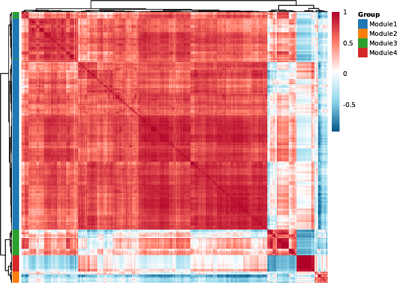<!-- -->

``` r
l4_5<-spatrio_score(l4_5,module_list,nbin = 5,ctrl = 20,clean=T)
data=data.frame(Module1=l4_5$Module1,Module2=l4_5$Module2,Module3=l4_5$Module3,Module4=l4_5$Module4,cluster=l4_5$ATAC_Cluster)
my_comparisons <- list(c("A9", "A3"),c("A2", "A9"))
plot=list()
plot[[1]]<-spatrio_boxplot(data,x="cluster",
            y="Module1",
            ylab = "Motif module score",
            title = "Module1",
            compare = my_comparisons,
            cols=atac_col[unique(data$cluster)])+
            theme(axis.text.x = element_text(color ="black",angle = 45,hjust = 1))

my_comparisons <- list(c("A2", "A9"),c("A3", "A2"))
plot[[2]]<-spatrio_boxplot(data,x="cluster",
            y="Module2",
            ylab = "Motif module score",
            title="Module2",
            compare = my_comparisons,
            cols=atac_col[unique(data$cluster)])+
            theme(axis.text.x = element_text(color ="black",angle = 45,hjust = 1))

my_comparisons <- list(c("A3", "A9"),c("A3", "A2"))
plot[[3]]<-spatrio_boxplot(data,x="cluster",
            y="Module3",
            ylab = "Motif module score",
            title="Module3",
            compare = my_comparisons,
            cols=atac_col[unique(data$cluster)])+
            theme(axis.text.x = element_text(color ="black",angle = 45,hjust = 1))

my_comparisons <- list(c("A3", "A9"),c("A3", "A2"))
plot[[4]]<-spatrio_boxplot(data,x="cluster",
            y="Module4",
            ylab = "Motif module score",
            title="Module4",
            compare = my_comparisons,
            cols=atac_col[unique(data$cluster)])+
            theme(axis.text.x = element_text(color ="black",angle = 45,hjust = 1))
CombinePlots(plot,ncol = 4)
```

    ## Warning: CombinePlots is being deprecated. Plots should now be combined using
    ## the patchwork system.

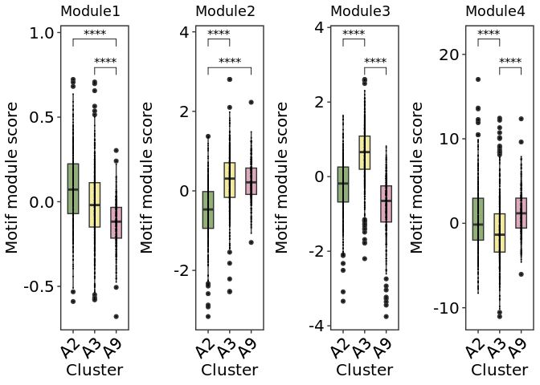<!-- -->
